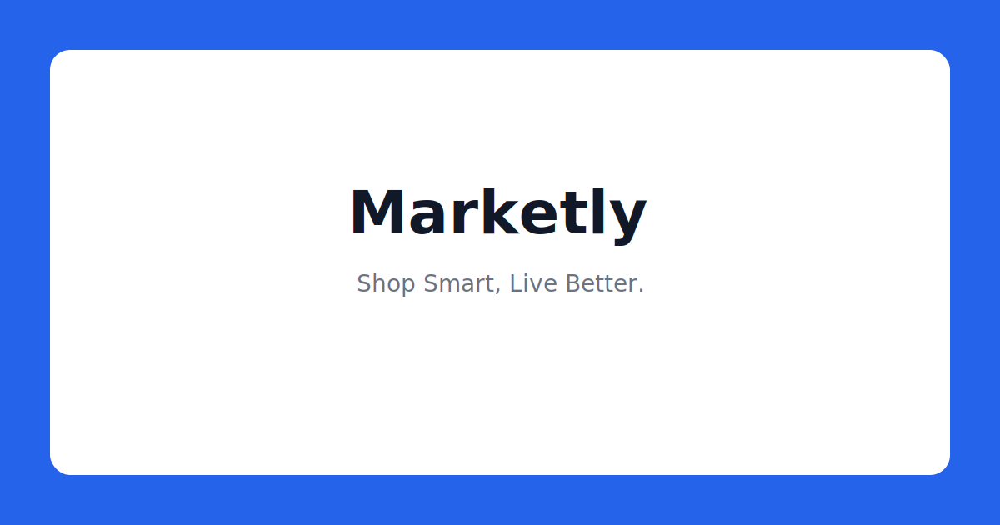

# Marketly — Online Shopping in Kenya

A mobile-first, static e-commerce home screen for **Marketly**, a Kenyan online marketplace. Built with semantic HTML5 and hand-written CSS3 — no frameworks, no build tools, no JavaScript except a minimal countdown timer.

**Live demo:** `https://YOUR-USERNAME.github.io/marketly-store/`

## Tech Stack

- **HTML5** — semantic landmarks, schema.org structured data, Open Graph
- **CSS3** — custom properties (design tokens), Flexbox, Grid, scroll-snap, responsive breakpoints
- **JavaScript** — vanilla countdown timer only (80 lines)
- **Deployment** — GitHub Pages

## Features

- 13-section mobile shopping home screen matching the Marketly reference design
- Reusable component system: product card, scroll rail, section header, price pair, discount badge, count badge, promo card
- Blue/amber/red brand palette with CSS custom properties
- Fully responsive: mobile-first → tablet (576px) → desktop (992px)
- SEO-ready: meta tags, Open Graph, Twitter card, JSON-LD Product markup, robots.txt, sitemap.xml
- Accessible: semantic HTML, ARIA labels, visible focus states, skip-to-content link, `prefers-reduced-motion` support

## Screenshots



*Screenshot reference — product images are labeled placeholders.*

## Getting Started

### Local Setup

```bash
# Clone the repository
git clone https://github.com/YOUR-USERNAME/marketly-store.git

# Navigate into the project
cd marketly-store

# Open in browser
open index.html
```

No build step required — open `index.html` directly in any modern browser.

### Project Structure

```
marketly-store/
├── index.html          # Main landing page (all 13 sections)
├── css/
│   └── styles.css      # All styles — tokens, layout, components
├── js/
│   └── countdown.js    # Vanilla JS flash-deal countdown
├── assets/
│   └── img/            # Placeholder product and category images
├── robots.txt          # SEO: search engine crawl instructions
├── sitemap.xml         # SEO: XML sitemap
├── .gitignore
└── README.md
```

### Customization

1. Replace placeholder images in `assets/img/` with real product photos
2. Update brand colors in `css/styles.css` `:root` custom properties
3. Update `robots.txt` and `sitemap.xml` with your production URL
4. Replace sample product data with real inventory (prices in KES)

## Commit History

The project follows conventional commits (`feat:`, `fix:`, `docs:`, `style:`, `chore:`) with 13 meaningful, scoped increments.

```
feat: scaffold project structure and base HTML with brand tokens
feat: build announcement bar and app header with cart/wishlist badges
feat: add search bar and scrollable category chips
feat: build hero banner with product cluster and trust strip
feat: add flash deal strip with countdown layout
feat: build popular categories and reusable product card
feat: add dual brand promo banners and best sellers scroll rail
feat: build testimonial, newsletter sign-up, and fixed bottom tab navigation
feat: add vanilla JS flash-deal countdown timer
fix: correct trust strip to KES and polish spacing
feat: add robots.txt and sitemap.xml for SEO
feat: add Open Graph image for social sharing
docs: add README with setup instructions and project description
```

## Assignment Requirements

- [x] Git repository initialized with `main` branch
- [x] 10+ meaningful commits with descriptive messages (`feat:`, `fix:`, `docs:`, `style:`, `chore:`)
- [x] Professional `README.md` with description, screenshots, and setup instructions
- [x] `.gitignore` configured for static site project
- [x] Hosted on GitHub Pages

## Credits

- **Design reference:** Marketly mobile shopping screen
- **Icon set:** Lucide (inline SVGs)
- **Font:** Inter via Google Fonts
- **Built by:** Victor Mwendwa & Antigravity
